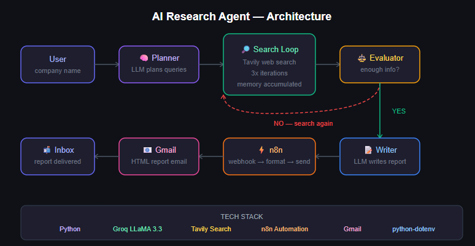

# AI Research Agent 🤖

An autonomous AI agent that researches any company and delivers a structured report via email — automatically.

## What It Does

Give it a company name. The agent:
1. **Plans** its own search strategy
2. **Searches** the web multiple times using Tavily
3. **Evaluates** whether it has enough information
4. **Searches again** if needed
5. **Writes** a structured research report
6. **Delivers** it to your inbox via n8n

## Demo

```
Enter company name: Klaiya Digital

🤖 Agent starting research on: Klaiya Digital
🔄 Agent thinking... (step 1: planning searches)
📋 Search plan:
1. Klaiya Digital company overview Philippines
2. Klaiya Digital recent news 2025 2026
3. Klaiya Digital key people leadership

🔎 Searching: Klaiya Digital company overview Philippines
🔎 Searching: Klaiya Digital recent news 2025 2026
🔎 Searching: Klaiya Digital key people leadership

🔄 Agent thinking... (evaluating)
🧠 Agent evaluation: YES

🔄 Agent thinking... (final step: writing report)

📊 FINAL REPORT
==================================================
1. Company Overview: Klaiya Digital is a leading online 
advertising agency based in Binondo, Manila...
==================================================

✅ Report sent to n8n successfully!
```

## Architecture



## Tech Stack

| Tool | Purpose |
|---|---|
| Python | Core agent logic |
| Groq API | LLM inference (LLaMA 3.3 70b) |
| Tavily API | Web search for agents |
| n8n | Workflow automation + email delivery |
| python-dotenv | Environment variable management |

## Setup

**1. Clone the repo**
```bash
git clone https://github.com/yourusername/ai-research-agent
cd ai-research-agent
```

**2. Install dependencies**
```bash
uv init
uv add groq tavily-python python-dotenv requests
```

**3. Add your API keys**
```bash
cp .env.example .env
```
Then fill in your keys in `.env`

**4. Run the agent**
```bash
uv run agent.py
```

## n8n Workflow

The agent sends a POST request to an n8n webhook with:
```json
{
  "company": "Company Name",
  "report": "Full research report...",
  "timestamp": "2026-06-09"
}
```

n8n then formats the report as HTML and delivers it via Gmail.

## Key Design Decisions

- **Groq over OpenAI** — faster inference, free tier, no budget needed for development
- **Prompt-based planning over native tool calling** — more stable across LLM providers
- **n8n for delivery** — keeps Python focused on AI logic, n8n handles operations
- **Max iterations cap** — prevents infinite loops, keeps costs predictable

## Skills Demonstrated

`Python` `LLM Integration` `Agentic AI` `Prompt Engineering` `n8n Automation` `Webhook Integration` `API Integration`