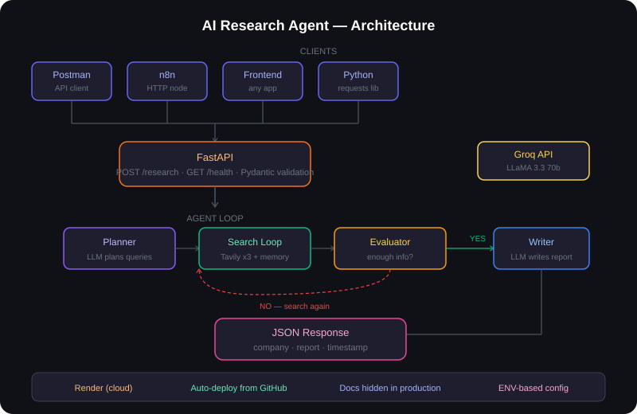

# AI Research Agent

An autonomous AI agent that researches any company and returns a structured report — available as both a local script and a deployed REST API.

## Live API

**Base URL:** `https://ai-research-agent-1bnl.onrender.com/`

```
POST /research
GET  /health
```

## What It Does

Give it a company name. The agent:

1. Plans its own search strategy using the LLM
2. Searches the web multiple times using Tavily
3. Accumulates findings into memory across searches
4. Evaluates whether it has enough information
5. Searches again if needed
6. Writes a structured research report
7. Returns the report as JSON via the API

## API Usage

**Request:**
```bash
POST /research
Content-Type: application/json

{
  "company": "Klaiya Digital"
}
```

**Response:**
```json
{
  "company": "Klaiya Digital",
  "report": "1. Company Overview: Klaiya Digital is a leading online advertising agency based in Binondo, Manila...",
  "timestamp": "2026-06-18"
}
```

**Health check:**
```bash
GET /health
→ {"status": "healthy"}
```

## Architecture



## Tech Stack

| Tool | Purpose |
|---|---|
| Python | Core agent logic |
| FastAPI | REST API wrapper |
| Uvicorn | ASGI server |
| Groq API | LLM inference (LLaMA 3.3 70b) |
| Tavily API | Web search for agents |
| n8n | Optional workflow automation and email delivery |
| Render | Cloud deployment |
| python-dotenv | Environment variable management |

## Setup — Run Locally

**1. Clone the repo**
```bash
git clone https://github.com/eriagbayani/AI-Research-Agent
cd ai-research-agent
```

**2. Install dependencies**
```bash
uv init
uv add groq tavily-python python-dotenv requests fastapi uvicorn
```

**3. Add your API keys**
```bash
cp .env.example .env
```

Fill in your keys:
```
GROQ_API_KEY=your_groq_key_here
TAVILY_API_KEY=your_tavily_key_here
ENV=development
```

**4. Run the API server**
```bash
uv run uvicorn main:app --reload
```

API runs at `http://localhost:8000`
Swagger docs at `http://localhost:8000/docs` (development only)

**5. Or run as a script**
```bash
uv run agent.py
```

## Setup — Deploy on Render

1. Push repo to GitHub
2. Go to render.com and create a new Web Service
3. Connect your GitHub repo
4. Set build command: `pip install -r requirements.txt`
5. Set start command: `uvicorn main:app --host 0.0.0.0 --port $PORT`
6. Add environment variables:
```
GROQ_API_KEY=your_groq_key_here
TAVILY_API_KEY=your_tavily_key_here
ENV=production
```
7. Deploy

## n8n Integration

The script version sends results to an n8n webhook for email delivery:

```json
{
  "company": "Company Name",
  "report": "Full research report...",
  "timestamp": "2026-06-18"
}
```

n8n formats the report as HTML and delivers via Gmail.

## Key Design Decisions

- **FastAPI over Flask** — automatic request validation via Pydantic, built-in OpenAPI schema, better async support
- **Docs hidden in production** — `/docs` and `/redoc` disabled via ENV flag, standard security practice
- **Groq over OpenAI** — faster inference, free tier, no budget needed for development
- **Prompt-based planning over native tool calling** — more stable across LLM providers; LLaMA's native tool calling was unreliable, so the LLM outputs a structured search plan as text instead
- **n8n for delivery** — keeps Python focused on AI logic, n8n handles the operational layer
- **Max iterations cap** — prevents infinite loops, keeps API response times and costs predictable
- **Stateless API** — no database needed; each request is independent, report returned directly to caller

## Skills Demonstrated

`Python` `FastAPI` `REST API Design` `Pydantic` `LLM Integration` `Agentic AI` `Prompt Engineering` `n8n Automation` `Webhook Integration` `Render Deployment`